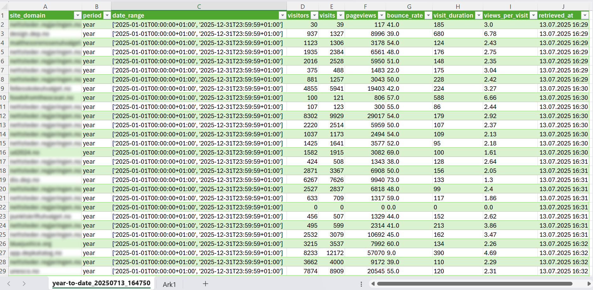

# Plausible Stats Aggregator

> [Vibe coded](https://gist.github.com/soderlind/e6fbf258f783fe1e930cb6d9e688086d)

A Python script that retrieves comprehensive analytics stats from all sites in your Plausible Analytics account and exports them to CSV files for month-to-date and year-to-date metrics.



## Features

- 🏢 **Multi-site Support**: Automatically discovers and processes all sites in your Plausible account
- 📊 **Comprehensive Metrics**: Collects visitors, visits, pageviews, bounce rate, visit duration, and views per visit
- 📅 **Multiple Time Periods**: Generates separate reports for month-to-date and year-to-date stats
- 📈 **Aggregated Totals**: Includes summary totals across all sites
- 🚦 **Rate Limiting**: Respects Plausible's API rate limits (600 requests/hour)
- 🛡️ **Error Handling**: Robust error handling with retry logic and comprehensive logging
- 📁 **CSV Export**: Clean, formatted CSV files ready for analysis

## Requirements

- Python 3.7+
- Plausible Analytics account with API access
- Sites API key and Stats API key from Plausible

## Installation

1. Clone or download this repository
2. Install dependencies:
   ```bash
   pip install -r requirements.txt
   ```

3. Copy the environment template:
   ```bash
   cp .env.example .env
   ```

4. Edit `.env` and add your Plausible API keys:
   ```
   PLAUSIBLE_SITES_API_KEY=your_sites_api_key_here
   PLAUSIBLE_STATS_API_KEY=your_stats_api_key_here
   ```

## Getting API Keys

You need two separate API keys from Plausible:

### 1. Sites API Key
1. Log in to your Plausible Analytics account
2. Go to Settings → API Keys
3. Click "New API Key" → "Sites API"
4. Save the key (shown only once)

### 2. Stats API Key
1. In the same API Keys section
2. Click "New API Key" → "Stats API"
3. Save the key (shown only once)

## Usage

Run the script:
```bash
python main.py
```

The script will:
1. Discover all sites in your Plausible account
2. Retrieve analytics stats for each site
3. Generate CSV files in the `./output/` directory:
   - `month-to-date_YYYYMMDD_HHMMSS.csv`
   - `year-to-date_YYYYMMDD_HHMMSS.csv`
   - `export-summary_YYYYMMDD_HHMMSS.txt`

## Output Format

Each CSV file contains the following columns:

- **site_domain**: The domain name of the site
- **period**: Time period ('month' or 'year')
- **date_range**: Actual date range processed
- **visitors**: Number of unique visitors
- **visits**: Number of visits/sessions
- **pageviews**: Number of page views
- **bounce_rate**: Bounce rate percentage
- **visit_duration**: Average visit duration in seconds
- **views_per_visit**: Average pages per visit
- **retrieved_at**: Timestamp when data was retrieved

The files also include a **TOTAL** row with aggregated metrics across all sites.

## Configuration

You can customize the behavior by editing `.env`:

```
# API Configuration
PLAUSIBLE_SITES_API_KEY=your_sites_api_key
PLAUSIBLE_STATS_API_KEY=your_stats_api_key
PLAUSIBLE_BASE_URL=https://plausible.io

# Output Configuration
OUTPUT_DIR=./output

# Logging
LOG_LEVEL=INFO
```

## Project Structure

```
plausible-stats-aggregator/
├── config/
│   └── settings.py          # Configuration management
├── src/
│   ├── clients/
│   │   ├── base_client.py   # Base API client
│   │   ├── sites_client.py  # Sites API client
│   │   └── stats_client.py  # Stats API client
│   ├── models/
│   │   └── data_models.py   # Data classes
│   ├── processors/
│   │   └── stats_processor.py # Data processing
│   └── exporters/
│       └── csv_exporter.py  # CSV export functionality
├── output/                  # Generated CSV files
├── logs/                    # Application logs
├── requirements.txt         # Python dependencies
├── .env.example            # Environment template
└── main.py                 # Main application
```

## Logging

The script creates detailed logs in the `logs/` directory with timestamps. Logs include:
- API request/response details
- Processing steps and progress
- Error messages and warnings
- Performance metrics

## Error Handling

The script handles various error scenarios:
- **API Rate Limiting**: Automatically waits and retries
- **Network Issues**: Retries with exponential backoff
- **Invalid Data**: Validates and cleans data before export
- **Missing Sites**: Continues processing other sites if one fails

## Rate Limiting

The script respects Plausible's rate limits:
- Maximum 600 requests per hour for Stats API
- Automatic delay between requests (3.6 seconds by default)
- Handles 429 rate limit responses gracefully

## Troubleshooting

### Common Issues

1. **API Key Errors**
   - Ensure you have both Sites API and Stats API keys
   - Check that keys are correctly set in `.env`
   - Verify keys have the correct permissions

2. **No Sites Found**
   - Check that your Sites API key has access to your sites
   - Verify you have sites in your Plausible account

3. **Rate Limiting**
   - The script automatically handles rate limits
   - For large numbers of sites, expect longer run times

4. **Empty Stats**
   - Some sites may have no data for the requested period
   - Check the logs for specific error messages

### Debug Mode

Set `LOG_LEVEL=DEBUG` in `.env` for detailed debugging information.

## License

This project is open source and available under the MIT License.

## Contributing

Contributions are welcome! Please feel free to submit a Pull Request.
